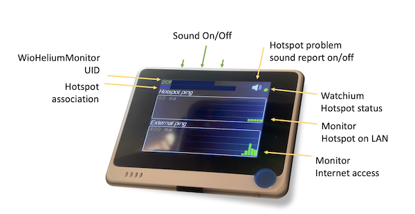
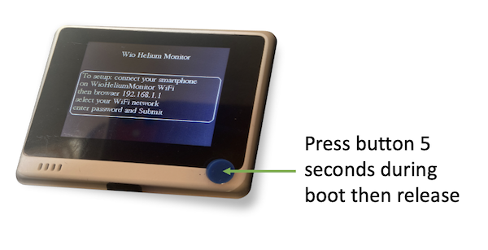
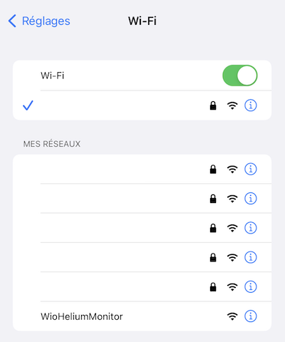
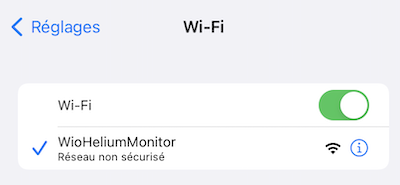
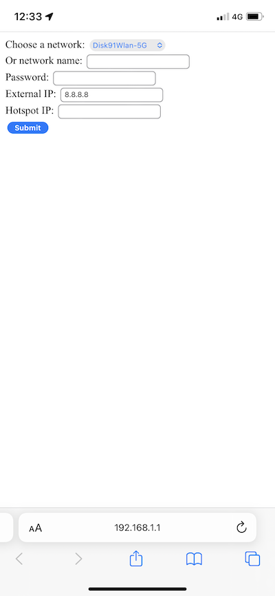
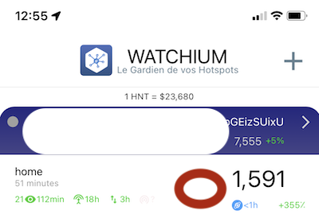
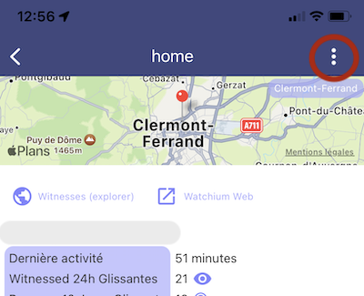
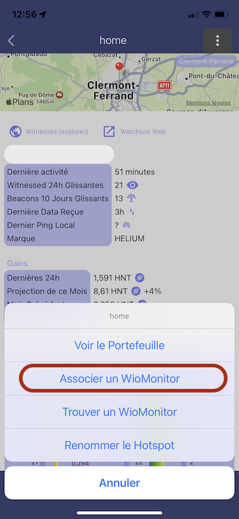
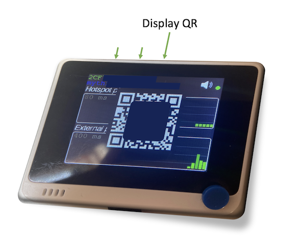

**Beta Open**

# WioHeliumMonitor

The purpose of this project is to monitor your Helium Hotspot and be alarmed when it is not working correctly.

The solution currently ping the miner over the LAN and ping Internet to make sure the Hotspot is connected to the LAN and have an access to Internet. It get the hotspot status from watchium application. It also communicate over LoRaWan to test the Hotspot LoRa communication. LoRaWan is also used to report status when the WAN is not working.

Information are reported to [Watchium Application](https://watchium.disk91.com) for monitoring and alarming your hotspot from your smartphone. 

All the Watchium User can use the WiFi information report. Watchium Silver & Gold user have the LoRaWan report enable. Watchium automatically distribute the LoRaWan credential and supports the communication costs.

See the setup process above.

## Requirements
The project uses a WIO Terminal you need to make some specific stuffs:
- Upgrade the WiFi firmware folowing the [Seeed documentation](https://wiki.seeedstudio.com/Wio-Terminal-Network-Overview/)

It can be use without a LoRa-E5 board, in this case, only the WiFi verification will be possible. To verify the LoRaWan communication, you need one of the following options:
- LoRa-E5 chassis from Seeedstudio
- Grove-E5 from Seeedstudio (connected on one of the two connectors)

If you want to use it from sources, you also need to make some modification on Arduino stack:
- Modifiy the native libraries to fix Arduino stuff:
   - the ping.c file in the libraries according to the ping.cpp content in this archive (bugfix)
   - the erpc_port_freertos file according to ping.cpp content (garbage collection hack)
- Needed libraries
	- QRcode from Richard More

## Setup WioHeliumMonitor

- Before flashing the pre-built firmware, make sure you have the **latest Wio WiFi firmware** (see above).
- The setup screen is automatically displayed, use the button if you need to change the setup.

- With you smartphone / Pc, connect to the Wio Helium Monitor

- Open a brother page on http://192.168.1.1

- Enter the WiFi informations and the IP of the Hotspot on the local network

- Submit the configuration, the Wio Helium monitor will reboot and start working

## Associate with [Watchium Application](https://watchium.disk91.com)

- Once you have created your account on Watchium, add your account and sync it to show you hotspots.

- You can select the Hotspot to associate with the Wio Helium Monitor

- Then select the hotspot menu

- Select the Wio Helium Monitor entry and follow the instruction

- You can display the Wio Helium Monitor ID as a QR Code 

## Coming later
- store WiFi configuration in an external flash for seamless upgrade

## Known problems
- WiFi network names & password with UTF8 or unusual characters is not supported
- The device will restart when the watchium server is not reachable. This is due to the Arduino stack never returning when the target server can't be reached. The bypass solution I found has side effect I was not able to debug in a short period of time.

## Changelog

### Version 1.0 - 2022-05-15
- Ready to be used, all features described above.

